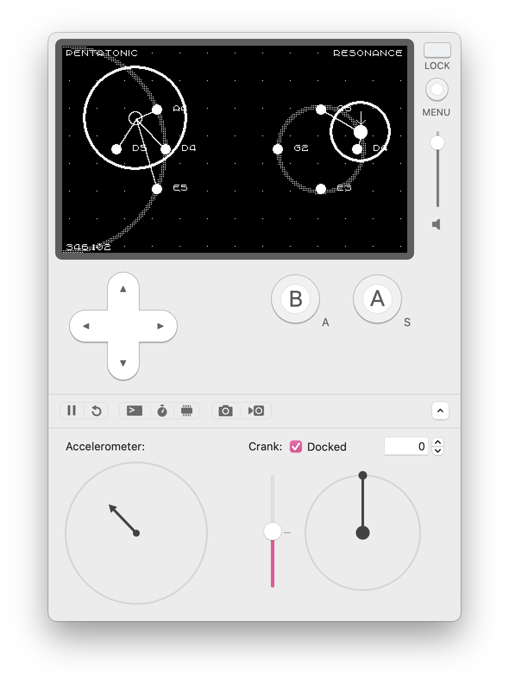

# Resonance

An instrument for playing drones on the Playdate.
Buy on [itch.io](https://orllewin.itch.io/resonance)

## Serial API

Terminate all commands with a newline char: `\n`. All numeric arguments should be integers in range 0 to 100, they're normalised internally to suitable values. 

### Synth waveforms

* `wf` - waveform select. Options are sine, square, sawtooth, triangle, phase, digital, vosim, noise. Example: `wf vosim\n`  

* `wfp1` and `wfp2` - waveform parameter. When waveform is phase, digital, or vosim there are two synth parameters available that change the character of the sound. Example: `wfp1 40\n`\

### Patch control 
* `plyr` - add player/visitor. Screen coordinates and size. Example: `plyr 40 200 120\n` 

* `note` - add note. Any midi note value with screen coordinates. Example: `note 48 200, 120\n`

* `octu` - move all notes up an octave

* `octd` - move all notes down an octave

* `clr` - remove all current notes and visitors. Resonance will be left in an empty state with a single visitor.

* `patch` - tells Resonance to print the current patch to serial out

### Effects

All delays have a max time of 3 seconds, which would be sent as 100 over the serial interface. 1.5 seconds would be 50. Delay volumes are capped at 0.5 internally to help tame runaway feedback, so the serial values 0 to 100 internally are between 0.0 and 0.5. You're unlikely to want to set delay feedback to more than 50 unless you're controlling it live. The Playdate engine seems to have a buffer overflow when delay is allowed to feedback too much, so keep it under control to avoid nasty audio glitches.

The effects are all added in series on the main audio channel, the order is: Synths > Pre-delay > RingMod > Bitcrusher > Overdrive > Mid-delay > Low-pass > High-pass > Post-delay > Output

See [Inside Playdate - Effects](https://sdk.play.date/3.0.0/Inside%20Playdate.html#C-sound.effect) for more information on the Playdate audio engine effects.

#### Pre delay

A delay applied to the synths before any other effect

* `pdt` - Pre-delay time
* `pdf` - Pre-delay feedback
* `pdm` - Pre-delay 'mix' (volume really)

#### Mid delay
* `mdt` - Mid-delay time
* `mdf` - Mid-delay feedback
* `mdm` - Mid-delay volume

#### Post delay
* `psdt` - Post-delay time
* `psdf` - Post-delay feedback
* `psdm` - Post-delay volume

#### Low-pass filter
* `lpf` - Low-pass frequency
* `lpr` - Low-pass resonance
* `lpm` - Low-pass mix

#### High-pass filter
* `hpf` - High-pass frequency
* `hpr` - High-pass resonance
* `hpm` - High-pass mix

#### Overdrive
* `odg` - Overdrive gain
* `odl` - Overdrive limit
* `odm` - Overdrive mix

#### Bitcrusher
* `bca` - Bitcrusher amount
* `bcu` - Bitcrusher undersampling
* `bcm` - Bitcrusher mix

#### Ring modulator
* `rmf` - Ring-mod frequency
* `rmm` - Ring-mod mix

## Inspiration
* [Popol Vuh Improvisation 1971](https://www.youtube.com/watch?v=DON-CogKcfk)
* [Koma Electronik Chromaplane](https://www.youtube.com/watch?v=RY4J7RYBN2w)  